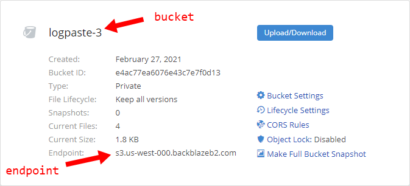
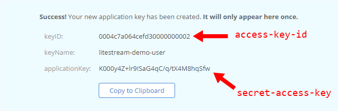

This guide will show you how to use Backblaze B2 as a database replica path for
Litestream.

## Create a bucket

To begin, you'll need a bucket to store your data. If you don't already have one
set up in Backblaze, follow the steps below:

1. From your Backblaze dashboard, go to _My Account > Buckets_
1. Click _"Create a Bucket"_
1. Enter a unique name for _"Bucket Unique Name"_ and leave the remaining fields as their defaults.
1. Click _"Create a Bucket"_
1. Copy the bucket details to the appropriate places in your `litestream.yml` file:



```yaml
dbs:
  - path: path-to-your-local-db-file
    replicas:
      - type: s3
        bucket: your-bucket-name
        path: db # change to whatever path you want
        endpoint: s3.us-west-000.backblazeb2.com # change this
        force-path-style: true
```

## Create a user

Next, create a user with programmatic access to the bucket you just created.

1. From your Backblaze dashboard, go to _My Account > App Keys_
1. Click _"Add Application Key"_
1. In _"Name of Key"_, enter any unique name
1. Under _"Allow access to Bucket(s)"_ select the bucket you created above.
1. Leave the remaining fields as their defaults.
1. Click _"Create new key"_
1. Copy the credentials to the appropriate places in your `litestream.yml` file
    * The `keyID` field is your `access-key-id`
    * The `applicationKey` field is your `secret-access-key`



```yaml
access-key-id: your-backblaze-keyID
secret-access-key: your-backblaze-applicationKey
```

## Configuration file

Your final `litestream.yml` configuration file should look like this:

```yaml
access-key-id: your-backblaze-keyID
secret-access-key: your-backblaze-applicationKey

dbs:
  - path: path-to-your-local-db-file
    replicas:
      - type: s3
        bucket: your-bucket-name
        path: db # change to whatever path you want
        endpoint: s3.us-west-000.backblazeb2.com # change this
        force-path-style: true
```
