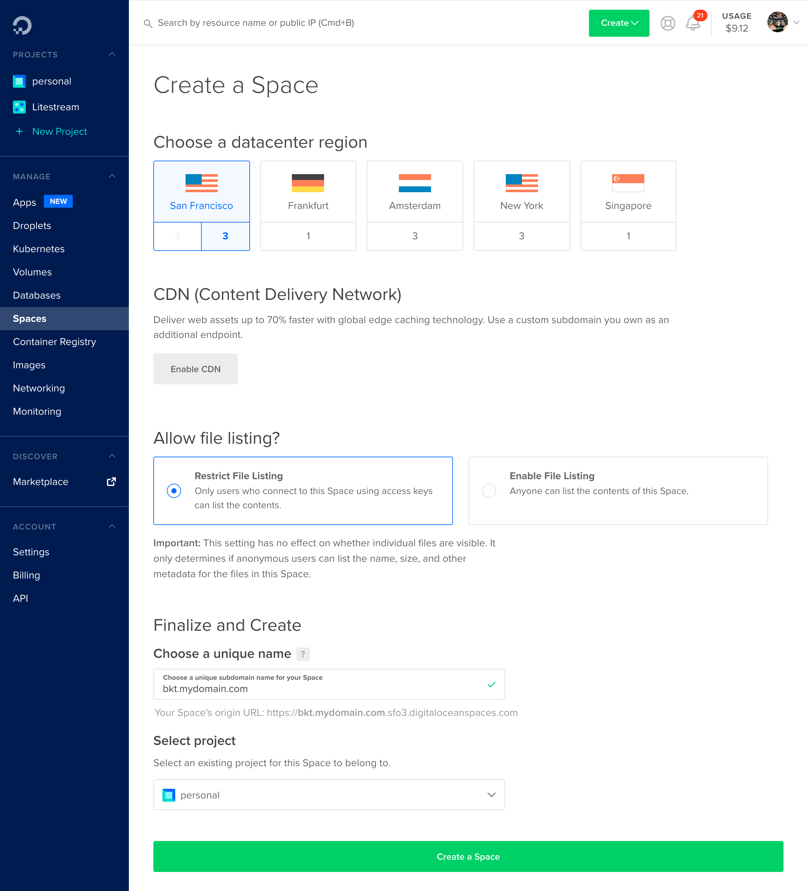
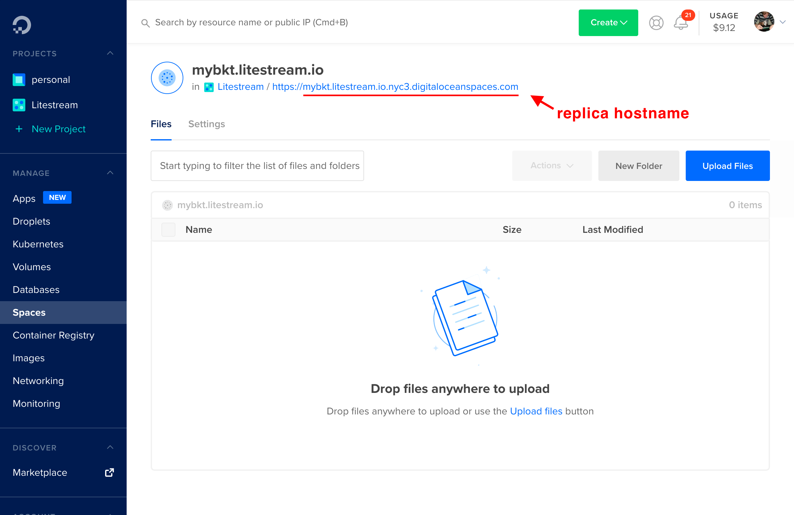
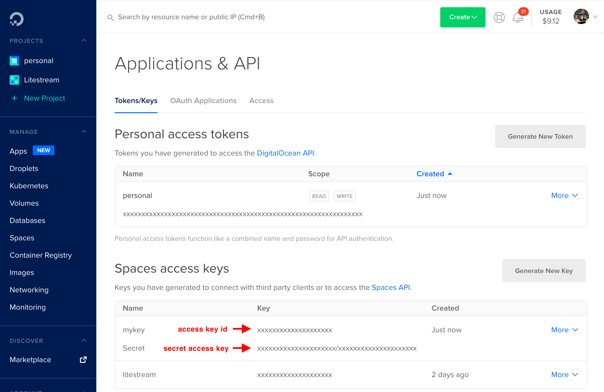

This guide will show you how to use [DigitalOcean Spaces][spaces] as a database
replica path for Litestream. You will need a [DigitalOcean][do] account to
complete this guide.


## Setup

### Create a space

In the [DigitalOcean Console][console], click on the green _"Create"_ button
in the top navigation and choose _"Spaces"_. You may need to enable spaces on
your account if you have not already. 

On the _"Create a Space"_ screen, you'll need to choose a region and name your
space a globally unique name. Then click the _"Create a Space"_ button at the
bottom of the screen.

<figure>
	
</figure>

After your space is created, you'll see the replica hostname of your space 
that includes your space name and region followed by `digitaloceanspaces.com`.
You'll need to use that later when configuring Litestream.

<figure>
    
</figure>


### Create a key

You'll need to create a key to authenticate Litestream to your account so it can
access the space. In the Spaces UI, click the _"Manage Keys"_ button. This will
bring up the _Applications & API_ screen.

Scroll down to the _Spaces access keys_ section and click the _"Generate New
Key"_ button. You'll need to provide a name for key and then hit Enter. You'll 
be presented with the access key id and secret access key. **You will need to
copy those for use later.**

<figure>
    
</figure>


## Usage

### Command line usage

You can replicate to [DigitalOcean Spaces][spaces] from the command line by
setting environment variables with the credentials you obtained after creating
your key:

```sh
export LITESTREAM_ACCESS_KEY_ID=xxxxxxxxxxxxxxxxxxxx
export LITESTREAM_SECRET_ACCESS_KEY=xxxxxxxxxxxxxxxxxxxxxxxxxxxxxx/xxxxxxxxx
```

Then you can specify your replica hostname as a replica URL on the command line.
For example, you can replicate a database to your space with the following command.
_Note that your region may be different._

```sh
litestream replicate /path/to/db s3://SPACENAME.nyc3.digitaloceanspaces.com/db
```

You can later restore your database from DigitalOcean Spaces to a local `my.db`
path with the following command.

```sh
litestream restore -o my.db s3://SPACENAME.nyc3.digitaloceanspaces.com/db
```

### Configuration file usage

Litestream is typically run as a background service which uses a configuration
file. You can configure a replica for your database using the `url` format.
_Note that your region may be different._

```yaml
access-key-id: xxxxxxxxxxxxxxxxxxxx
secret-access-key: xxxxxxxxxxxxxxxxxxxxxxxxxxxxxx/xxxxxxxxx

dbs:
  - path: /path/to/local/db
    replicas:
      - url: s3://SPACENAME.nyc3.digitaloceanspaces.com/db
```

Or you can expand your configuration into multiple fields:

```yaml
dbs:
  - path: /path/to/local/db
    replicas:
      - type: s3
        bucket:   SPACENAME
        path:     db
        endpoint: nyc3.digitaloceanspaces.com
        region:   nyc3   # set to your region
```

You may also specify your key credentials on a per-replica basis:

```yaml
dbs:
  - path: /path/to/local/db
    replicas:
      - url: s3://SPACENAME.nyc3.digitaloceanspaces.com/db
        access-key-id: xxxxxxxxxxxxxxxxxxx
        secret-access-key: xxxxxxxxxxxxxxxxxxxxxxxxxxxxxx/xxxxxxxxx
```


## Important Note

It is common to see errors in the Litestream log when using DigitalOcean Spaces.
Typically, it shows a `send request failed` error followed by a `connection
reset by peer` error. This seems to be a socket that closes early on
DigitalOcean's servers. 

Litestream is built to handle many types of failures so these requests will be
retried on the next sync attempt which is 1 second later by default. While
it's always troublesome to see errors, these do not affect the integrity of your
backups.


[spaces]: https://www.digitalocean.com/products/spaces/
[do]: https://www.digitalocean.com/
[console]: https://cloud.digitalocean.com/
