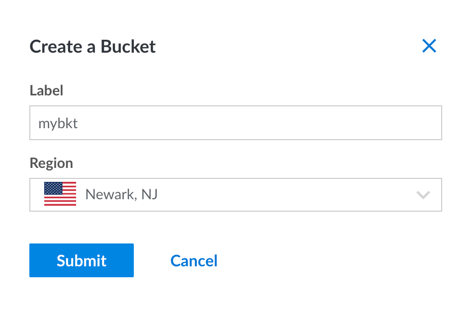
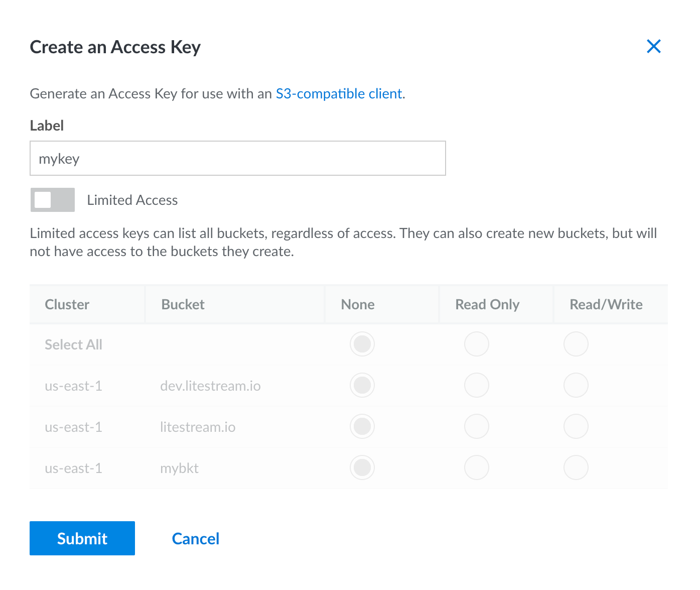
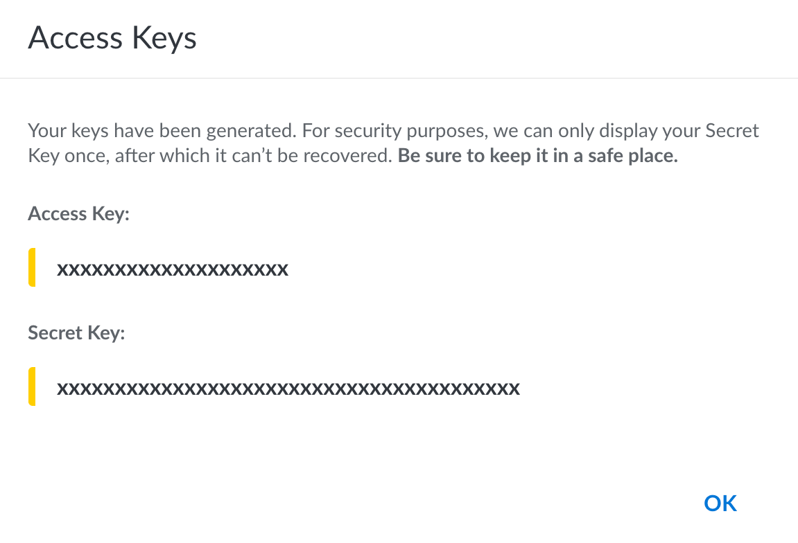

This guide will show you how to use [Linode Object Storage][object-storage] as a
database replica path for Litestream. You will need a [Linode][linode] account
to complete this guide.


## Setup

### Create a bucket

In the [Linode Console][console], click on _"Object Storage"_ from the navigation
and click the _"Create Bucket"_ button. You may need to enable Object Storage
on your account if you have not already.

Enter a globally unique name for your bucket and choose a region. Then click the
_"Submit"_ button.

<figure>
 
</figure>

After your bucket is created, you'll see a hostname for the bucket in the format
of `BUCKETNAME.REGION.linodeobjects.com`. You'll need to use that later when
configuring Litestream.


### Create an access key

You'll need to create a key to authenticate Litestream to your account so it can
access the bucket. In the [Object Storage
console](https://cloud.linode.com/object-storage), click the _Access Keys_ tab
in the top navigation and then click the _"Create an Access Key"_ button.

Enter a name for your key. You can enable _Limited Access_ if you want to
restrict the key to only certain buckets. Otherwise, click the _"Submit"_
button.

<figure>
    
</figure>

You'll be presented with the Access Key and Secret Key. **You will need to copy
those for use later.**

<figure>
    
</figure>


## Usage

### Command line usage

You can replicate to [Linode Object Storage][object-storage] from the command
line by setting environment variables with the credentials you obtained after
creating your key:

```sh
export LITESTREAM_ACCESS_KEY_ID=xxxxxxxxxxxxxxxxxxxx
export LITESTREAM_SECRET_ACCESS_KEY=xxxxxxxxxxxxxxxxxxxxxxxxxxxxxxxxxxxxxxxx
```

Then you can specify your replica hostname as a replica URL on the command line.
For example, you can replicate a database to your bucket with the following
command. _Note that your region may be different._

```sh
litestream replicate /path/to/db s3://BUCKETNAME.us-east-1.linodeobjects.com/db
```

You can later restore your database from Linode Object Storage to a local `my.db`
path with the following command.

```sh
litestream restore -o my.db s3://BUCKETNAME.us-east-1.linodeobjects.com/db
```

### Configuration file usage

Litestream is typically run as a background service which uses a configuration
file. You can configure a replica for your database using the `url` format.
_Note that your region may be different._

```yaml
access-key-id: xxxxxxxxxxxxxxxxxxxx
secret-access-key: xxxxxxxxxxxxxxxxxxxxxxxxxxxxxx/xxxxxxxxx

dbs:
  - path: /path/to/local/db
    replica:
      url: s3://BUCKETNAME.us-east-1.linodeobjects.com/db
```

Or you can expand your configuration into multiple fields:

```yaml
dbs:
  - path: /path/to/local/db
    replica:
      type: s3
      bucket:   BUCKETNAME
      path:     db
      endpoint: https://us-east-1.linodeobjects.com
      region:   us-east-1   # set to your region
```

You may also specify your key credentials on a per-replica basis:

```yaml
dbs:
  - path: /path/to/local/db
    replica:
      url: s3://BUCKETNAME.us-east-1.linodeobjects.com/db
      access-key-id: xxxxxxxxxxxxxxxxxxx
      secret-access-key: xxxxxxxxxxxxxxxxxxxxxxxxxxxxxxxxxxxxxxx
```


[object-storage]: https://www.linode.com/products/object-storage/
[linode]: https://www.linode.com/
[console]: https://cloud.linode.com/
