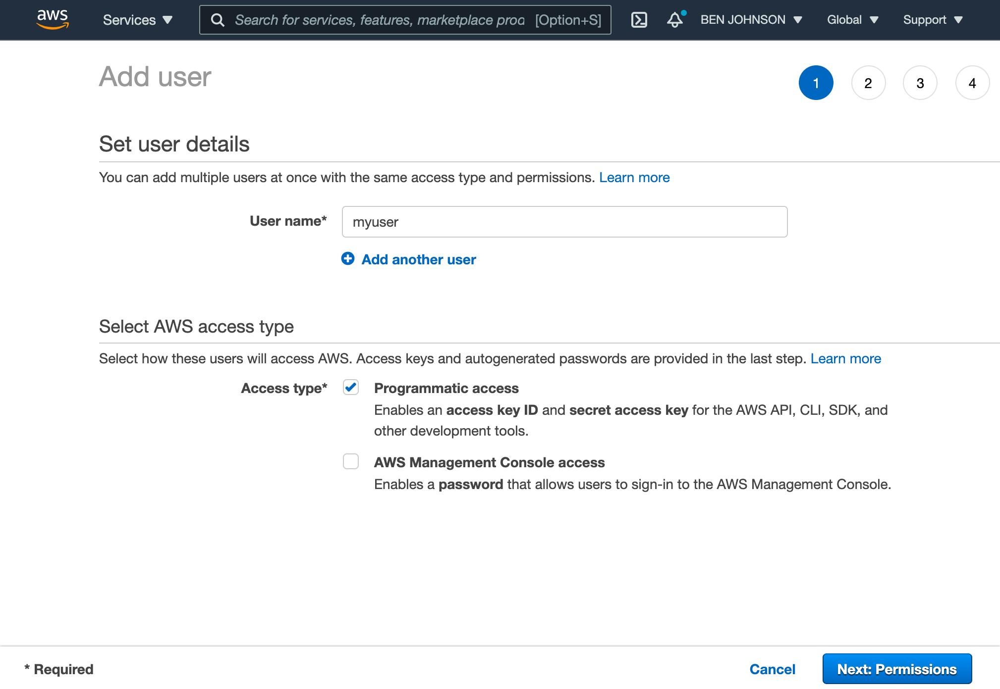
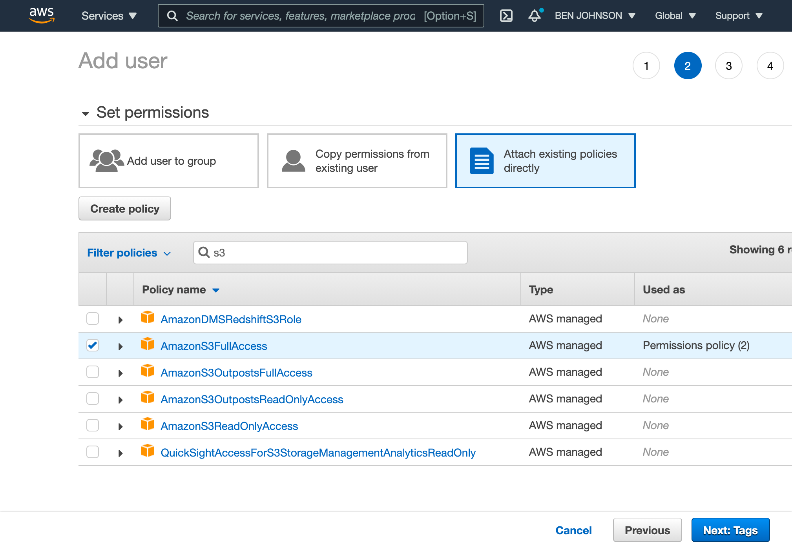
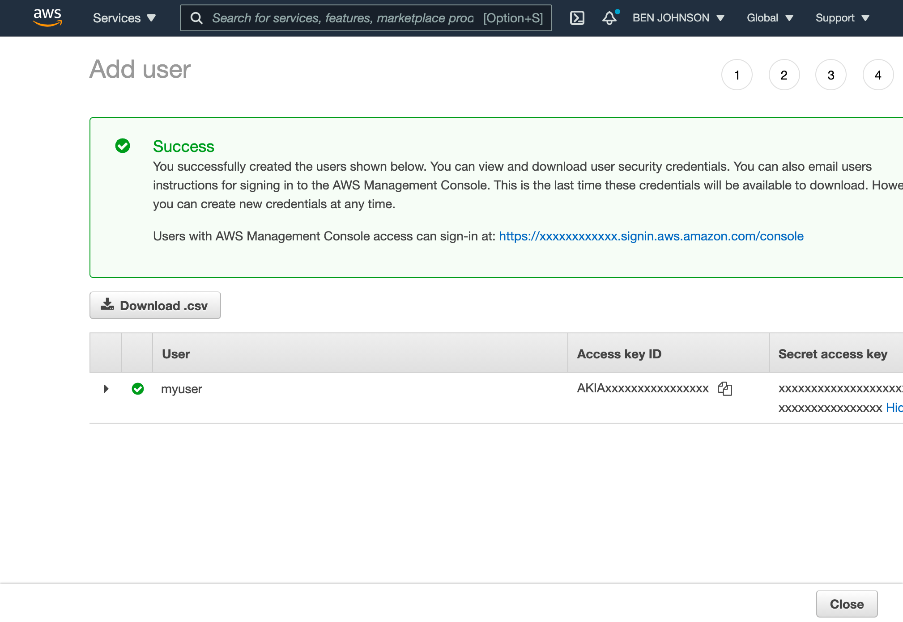
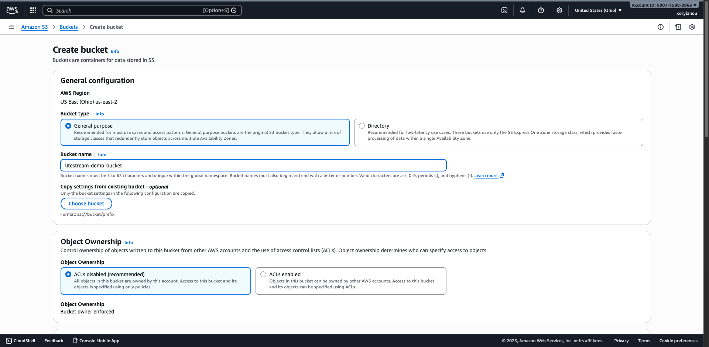
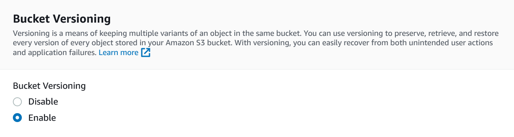
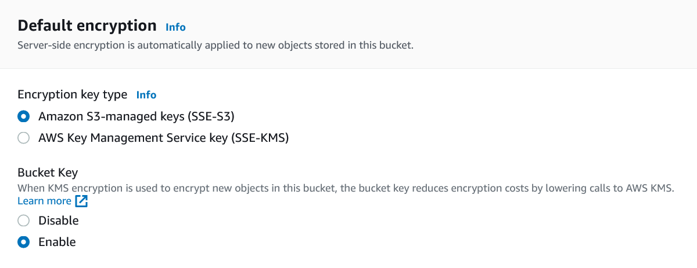

This guide will show you how to use Amazon S3 as a database replica path for
Litestream. You will need an [Amazon AWS](https://aws.amazon.com/) account to
complete this guide.

## Setup

### Create an IAM user

You will need to set up a user with programmatic access to work with Amazon S3.
From the [AWS Console](https://console.aws.amazon.com/), go to the IAM service.
Next, click _Users_ from the left-hand navigation and then click the _Create user_
button.

Enter a name for your user and click the _Next_ button.

<figure>
  
</figure>

On the permissions screen, select _"Attach policies directly"_, then search for
"S3" and choose `AmazonS3FullAccess`. You can also specify a [more restrictive
policy](#restrictive-iam-policies) as described later in this guide. Click _Next_
to continue.

<figure>
  
</figure>

Review the user details and click _Create user_. After the user is created,
navigate to the user's _Security credentials_ tab and click _Create access key_.
Select your use case, acknowledge the warning, and create the key. You will need
to save the _"Access key ID"_ and _"Secret access key"_ for later use in this
guide.

<figure>
  
</figure>


### Create a bucket

Once you have a user created, go to the [S3 service](https://s3.console.aws.amazon.com/)
in the AWS Console. Click the _"Create bucket"_ button.

You'll need to choose a globally unique bucket name and choose a region to
store the bucket data.

<figure>
  
</figure>

While Litestream files are immutable and don't require versioning, enabling S3
bucket versioning is a best practice that provides additional protection against
accidental deletions.

<figure>
  
</figure>

It is also recommended to enable default encryption to protect your data at rest.
The default _"Server-side encryption with Amazon S3 managed keys (SSE-S3)"_ option
is sufficient for most use cases.

<figure>
  
</figure>

Then click the _"Create bucket"_ button at the bottom of the screen. Your bucket
has now been created.


## Usage

### Command line usage

You can replicate to S3 from the command line by setting environment variables
with the credentials you obtained after creating your IAM user:

```sh
export AWS_ACCESS_KEY_ID=AKIAxxxxxxxxxxxxxxxx
export AWS_SECRET_ACCESS_KEY=xxxxxxxxxxxxxxxxxxxxxxxxxxxxxx/xxxxxxxxx
```

Then you can specify your bucket as a replica URL on the command line. For
example, you can replicate a database to your bucket with the following command.

Be sure to replace `/path/to/db` with the local file path of your database, replace
`BUCKETNAME` with the name of your bucket, and replace `PATHNAME` with the path
you want to store your replica within your bucket.

```sh
litestream replicate /path/to/db s3://BUCKETNAME/PATHNAME
```

You can later restore your database from S3 to a local `my.db` path with the
following command.

```sh
litestream restore -o my.db s3://BUCKETNAME/PATHNAME
```



### Configuration file usage

Litestream is typically run as a background service which uses a configuration
file. You can configure a replica for your database using the `url` format:

```yaml
access-key-id: AKIAxxxxxxxxxxxxxxxx
secret-access-key: xxxxxxxxxxxxxxxxxxxxxxxxxxxxxx/xxxxxxxxx

dbs:
  - path: /path/to/local/db
    replica:
      url: s3://BUCKETNAME/PATHNAME
```

Or you can expand your configuration into multiple fields:

```yaml
dbs:
  - path: /path/to/local/db
    replica:
      type: s3
      bucket: BUCKETNAME
      path:   PATHNAME
      region: us-east-1   # optional, set to your region
```

You may also specify your AWS credentials on a per-replica basis:

```yaml
dbs:
  - path: /path/to/local/db
    replica:
      url: s3://BUCKETNAME/PATHNAME
      access-key-id: AKIAxxxxxxxxxxxxxxxx
      secret-access-key: xxxxxxxxxxxxxxxxxxxxxxxxxxxxxx/xxxxxxxxx
```

 Litestream v0.5.0+ uses AWS SDK v2, which maintains compatibility with existing authentication methods.


## Using S3 Access Points

 Litestream supports [S3 Access Points](https://docs.aws.amazon.com/AmazonS3/latest/userguide/access-points.html),
which provide dedicated endpoints for accessing shared datasets in S3. Access
points are useful for VPC-only configurations, simplified access control, and
improved network performance.

### Benefits

- **VPC-only access**: Route backup traffic through VPC endpoints instead of
  NAT gateways for improved security and network isolation
- **Reduced costs**: Eliminate NAT gateway data transfer charges, which can be
  significant for large databases
- **Lower latency**: Direct VPC connectivity provides better performance
- **Simplified access control**: Delegate permissions to access point policies
  for multi-tenant scenarios

### URL Format

Specify access point ARNs using the `s3://` URL scheme followed by the ARN:

```
s3://arn:aws:s3:REGION:ACCOUNT-ID:accesspoint/ACCESS-POINT-NAME[/PATH]
```

The region is automatically extracted from the ARN but can be explicitly
overridden in the configuration.

### Command Line Usage

```sh
litestream replicate /path/to/db \
  s3://arn:aws:s3:us-east-2:123456789012:accesspoint/my-access-point/backups
```

### Configuration File Usage

```yaml
dbs:
  - path: /path/to/db
    replica:
      url: s3://arn:aws:s3:us-east-2:123456789012:accesspoint/my-access-point/backups/prod
```

If you need to override the region extracted from the ARN:

```yaml
dbs:
  - path: /path/to/db
    replica:
      url: s3://arn:aws:s3:us-east-2:123456789012:accesspoint/my-access-point/backups
      region: us-east-2
```

### IAM Policy for Access Points

Access points require IAM permissions on **both** the access point and the
underlying bucket. For an application to access objects through an access point,
both the access point policy and the bucket must permit the request.

There are two approaches to configure this:

#### Option 1: Explicit Permissions on Both ARNs (Recommended for Restrictive Policies)

The following IAM policy grants permissions on both the access point and the
underlying bucket ARNs. This approach is useful when you need fine-grained
control or when the bucket policy doesn't delegate to access points:

```json
{
    "Version": "2012-10-17",
    "Statement": [
        {
            "Effect": "Allow",
            "Action": [
                "s3:GetBucketLocation",
                "s3:ListBucket"
            ],
            "Resource": [
                "arn:aws:s3:us-east-2:123456789012:accesspoint/my-access-point",
                "arn:aws:s3:::my-bucket"
            ]
        },
        {
            "Effect": "Allow",
            "Action": [
                "s3:PutObject",
                "s3:DeleteObject",
                "s3:GetObject"
            ],
            "Resource": [
                "arn:aws:s3:us-east-2:123456789012:accesspoint/my-access-point/object/*",
                "arn:aws:s3:::my-bucket/*"
            ]
        }
    ]
}
```

Replace `123456789012` with your AWS account ID, `us-east-2` with your region,
`my-access-point` with your access point name, and `my-bucket` with your bucket name.

#### Option 2: Delegate Access Control to Access Points (Recommended for Simplified Management)

Add this bucket policy to delegate all access control to your access points:

```json
{
    "Version": "2012-10-17",
    "Statement": [
        {
            "Effect": "Allow",
            "Principal": {"AWS": "*"},
            "Action": "*",
            "Resource": [
                "arn:aws:s3:::my-bucket",
                "arn:aws:s3:::my-bucket/*"
            ],
            "Condition": {
                "StringEquals": {
                    "s3:DataAccessPointAccount": "123456789012"
                }
            }
        }
    ]
}
```

With this bucket policy in place, you only need the access point ARN in your
IAM policy:

```json
{
    "Version": "2012-10-17",
    "Statement": [
        {
            "Effect": "Allow",
            "Action": [
                "s3:GetBucketLocation",
                "s3:ListBucket"
            ],
            "Resource": "arn:aws:s3:us-east-2:123456789012:accesspoint/my-access-point"
        },
        {
            "Effect": "Allow",
            "Action": [
                "s3:PutObject",
                "s3:DeleteObject",
                "s3:GetObject"
            ],
            "Resource": "arn:aws:s3:us-east-2:123456789012:accesspoint/my-access-point/object/*"
        }
    ]
}
```

See the [AWS documentation](https://docs.aws.amazon.com/AmazonS3/latest/userguide/access-points-policies.html)
for more details on configuring access point and bucket policies.

### VPC Endpoint Configuration

To use VPC-only access points, you must configure a VPC Gateway Endpoint for S3
in your VPC. Gateway endpoints are free and route traffic through the AWS
backbone network instead of the public internet, improving security and
reducing NAT gateway costs.

The access point's network origin must be set to "VPC" when creating it.

#### Terraform Example

```hcl
resource "aws_vpc_endpoint" "s3" {
  vpc_id            = aws_vpc.main.id
  service_name      = "com.amazonaws.${var.aws_region}.s3"
  vpc_endpoint_type = "Gateway"
  route_table_ids   = [aws_route_table.private.id]

  tags = {
    Name = "s3-gateway-endpoint"
  }
}
```

#### CloudFormation Example

```yaml
Resources:
  S3GatewayEndpoint:
    Type: AWS::EC2::VPCEndpoint
    Properties:
      VpcId: !Ref VPC
      ServiceName: !Sub "com.amazonaws.${AWS::Region}.s3"
      VpcEndpointType: Gateway
      RouteTableIds:
        - !Ref PrivateRouteTable
```

After creating the VPC endpoint, ensure your access point's network origin is
set to "VPC" and specifies your VPC ID. See
[Creating access points restricted to a VPC](https://docs.aws.amazon.com/AmazonS3/latest/userguide/access-points-vpc.html)
for detailed setup instructions.

### Troubleshooting Access Points

Common errors when configuring S3 access points:

| Error | Cause | Solution |
|-------|-------|----------|
| `no identity-based policy allows the s3:PutObject action` | IAM policy not attached to user/role or missing required permissions | Verify the IAM policy is attached and includes both access point and bucket ARNs (see [IAM Policy for Access Points](#iam-policy-for-access-points)) |
| `explicit deny in a resource-based policy` | Access point policy or bucket policy is blocking the request | Check both the access point policy and bucket policy; ensure the bucket delegates to access points or explicitly allows access |
| `Access Denied` when using VPC access point | VPC endpoint not configured or route table not associated | Create a VPC Gateway Endpoint for S3 and associate it with your private subnet's route table |
| `Could not connect to the endpoint URL` | Network cannot reach the access point | For VPC-only access points, ensure your application runs within the VPC and the VPC endpoint is properly configured |


## Restrictive IAM Policies

While specifying `AmazonS3FullAccess` is an easy way to get up and running, you
may want to specify a more restrictive policy in order to limit abuse if your
credentials are compromised.

### Replication Policy (Read-Write)

The following policy provides the minimum permissions needed for Litestream to
replicate databases to S3. This includes creating, updating, and deleting
replica files. Please replace `<BUCKET>` with the name of your bucket.

```json
{
    "Version": "2012-10-17",
    "Statement": [
        {
            "Effect": "Allow",
            "Action": [
                "s3:GetBucketLocation",
                "s3:ListBucket"
            ],
            "Resource": "arn:aws:s3:::<BUCKET>"
        },
        {
            "Effect": "Allow",
            "Action": [
                "s3:PutObject",
                "s3:DeleteObject",
                "s3:GetObject"
            ],
            "Resource": [
                "arn:aws:s3:::<BUCKET>/*"
            ]
        }
    ]
}
```

### Restoration Policy (Read-Only)

If you only need to restore databases from existing S3 replicas (without
creating new replicas), you can use this more restrictive read-only policy:

```json
{
    "Version": "2012-10-17",
    "Statement": [
        {
            "Effect": "Allow",
            "Action": [
                "s3:GetBucketLocation",
                "s3:ListBucket"
            ],
            "Resource": "arn:aws:s3:::<BUCKET>"
        },
        {
            "Effect": "Allow",
            "Action": [
                "s3:GetObject"
            ],
            "Resource": [
                "arn:aws:s3:::<BUCKET>/*"
            ]
        }
    ]
}
```

### Path-Specific Policies

For additional security, you can restrict access to a specific path within your
bucket by modifying the resource ARNs. For example, to limit access to the
`litestream/` directory:

```json
"Resource": [
    "arn:aws:s3:::<BUCKET>/litestream/*"
]
```

Thanks to [Martin](https://github.com/maluio) for contributing the original policy and
to [cariaso](https://github.com/benbjohnson/litestream/issues/76#issuecomment-783926359)
for additional policy insights.


## Custom Endpoints (S3-Compatible Services)

Litestream supports S3-compatible storage services such as MinIO, Backblaze B2,
DigitalOcean Spaces, and others. However, how you configure these services
depends on whether Litestream can auto-detect the endpoint from the URL.

### Auto-Detected Providers

When using the command line URL variant (`s3://BUCKET/PATH`), Litestream can
automatically detect the correct endpoint for these providers based on the URL
hostname pattern:

- **AWS S3**: Standard `s3://bucket/path` URLs
- **Backblaze B2**: URLs containing `.backblazeb2.com`
- **DigitalOcean Spaces**: URLs containing `.digitaloceanspaces.com`
- **Linode Object Storage**: URLs containing `.linodeobjects.com`
- **Scaleway**: URLs containing `.scw.cloud`

For these providers, you can use both command line and configuration file approaches.

### Services Requiring Configuration Files

For S3-compatible services that cannot be auto-detected from the URL hostname,
you **must** use a configuration file with the `endpoint` parameter. This includes:

- MinIO (self-hosted or remote)
- Self-hosted S3-compatible storage
- Other S3-compatible providers not in the auto-detected list

Attempting to use the command line URL variant with these services will result
in Litestream connecting to AWS S3 instead of your intended endpoint, causing
authentication errors like:

```text
cannot lookup bucket region: InvalidAccessKeyId: The AWS Access Key Id you
provided does not exist in our records.
```

### MinIO Example

For MinIO, always use a configuration file:

```yaml
dbs:
  - path: /path/to/local/db
    replica:
      type: s3
      bucket: mybucket
      path: mydb
      endpoint: https://minio.example.com:9000
      region: us-east-1
      access-key-id: ${MINIO_ACCESS_KEY}
      secret-access-key: ${MINIO_SECRET_KEY}
```

For detailed MinIO configuration options, see the
[MinIO Configuration](/reference/config#minio-configuration) section in the
configuration reference.


## See Also

- [S3 Advanced Configuration](/guides/s3-advanced) - Multipart uploads, storage classes, and more
- [S3-Compatible Services](/guides/s3-compatible) - DigitalOcean, Backblaze, and other providers
- [Troubleshooting](/docs/troubleshooting) - Common issues and solutions
- [Configuration Reference](/reference/config) - Complete configuration options
