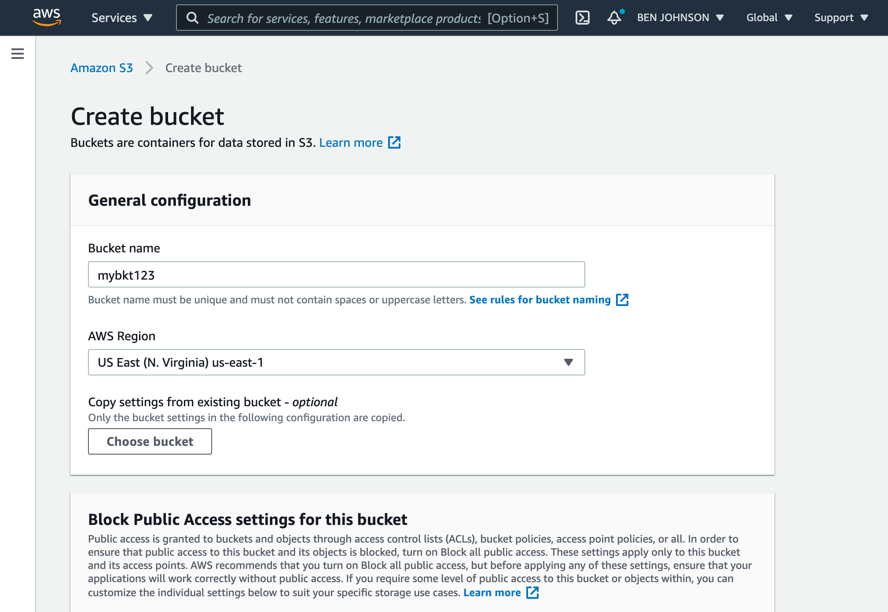

This guide will show you how to use Amazon S3 as a database replica path for
Litestream. You will need an [Amazon AWS](https://aws.amazon.com/) account to
complete this guide.

## Setup

### Create an IAM user

You will need to set up a user with programmatic access to work with Amazon S3.
From the [AWS Console](https://console.aws.amazon.com/), go to the IAM service.
Next, click _Users_ from the left-hand navigation and then click the _Add User_
button.

Enter a name for your user and make sure to enable _Programmatic Access_. Then
click the _Next_ button.

<figure>
 
</figure>

On the permissions screen, click on _"Attach existing policies directly"_, then
search for "S3" and choose `AmazonS3FullAccess`. You can also specify a [more
restrictive policy](#restrictive-iam-policy) as described later in this guide.

<figure>
 
</figure>

Then click the _Next_ button twice and then click the _Create user_ button. This
will create the user and display credentials for programmatic access. You will
need to save the _"Access key ID"_ and _"Secret access key"_ for later use
in this guide.

<figure>
 
</figure>


### Create a bucket

Once you have a user created, go to the [S3 service](https://s3.console.aws.amazon.com/)
in the AWS Console. Click the _"Create bucket"_ button.

You'll need to choose a globally unique bucket name and choose a region to
store the bucket data.

<figure>
 
</figure>

Then click the _"Create bucket"_ button at the bottom of the screen. Your bucket
has now been created.


## Usage

### Command line usage

You can replicate to S3 from the command line by setting environment variables
with the credentials you obtained after creating your IAM user:

```sh
export AWS_ACCESS_KEY_ID=AKIAxxxxxxxxxxxxxxxx
export AWS_SECRET_ACCESS_KEY=xxxxxxxxxxxxxxxxxxxxxxxxxxxxxx/xxxxxxxxx
```

Then you can specify your bucket as a replica URL on the command line. For
example, you can replicate a database to your bucket with the following command.

Be sure to replace `/path/to/db` with the local file path of your database, replace
`BUCKETNAME` with the name of your bucket, and replace `PATHNAME` with the path
you want to store your replica within your bucket.

```sh
litestream replicate /path/to/db s3://BUCKETNAME/PATHNAME
```

You can later restore your database from S3 to a local `my.db` path with the
following command.

```sh
litestream restore -o my.db s3://BUCKETNAME/PATHNAME
```

### Configuration file usage

Litestream is typically run as a background service which uses a configuration
file. You can configure a replica for your database using the `url` format:

```yaml
access-key-id: AKIAxxxxxxxxxxxxxxxx
secret-access-key: xxxxxxxxxxxxxxxxxxxxxxxxxxxxxx/xxxxxxxxx

dbs:
  - path: /path/to/local/db
    replica:
      url: s3://BUCKETNAME/PATHNAME
```

Or you can expand your configuration into multiple fields:

```yaml
dbs:
  - path: /path/to/local/db
    replica:
      type: s3
      bucket: BUCKETNAME
      path:   PATHNAME
      region: us-east-1   # optional, set to your region
```

You may also specify your AWS credentials on a per-replica basis:

```yaml
dbs:
  - path: /path/to/local/db
    replica:
      url: s3://BUCKETNAME/PATHNAME
      access-key-id: AKIAxxxxxxxxxxxxxxxx
      secret-access-key: xxxxxxxxxxxxxxxxxxxxxxxxxxxxxx/xxxxxxxxx
```

 Litestream v0.5.0+ uses AWS SDK v2, which maintains compatibility with existing authentication methods.


## Restrictive IAM Policies

While specifying `AmazonS3FullAccess` is an easy way to get up and running, you
may want to specify a more restrictive policy in order to limit abuse if your
credentials are compromised.

### Replication Policy (Read-Write)

The following policy provides the minimum permissions needed for Litestream to
replicate databases to S3. This includes creating, updating, and deleting
replica files. Please replace `<BUCKET>` with the name of your bucket.

```json
{
    "Version": "2012-10-17",
    "Statement": [
        {
            "Effect": "Allow",
            "Action": [
                "s3:GetBucketLocation",
                "s3:ListBucket"
            ],
            "Resource": "arn:aws:s3:::<BUCKET>"
        },
        {
            "Effect": "Allow",
            "Action": [
                "s3:PutObject",
                "s3:DeleteObject",
                "s3:GetObject"
            ],
            "Resource": [
                "arn:aws:s3:::<BUCKET>/*"
            ]
        }
    ]
}
```

### Restoration Policy (Read-Only)

If you only need to restore databases from existing S3 replicas (without
creating new replicas), you can use this more restrictive read-only policy:

```json
{
    "Version": "2012-10-17",
    "Statement": [
        {
            "Effect": "Allow",
            "Action": [
                "s3:GetBucketLocation",
                "s3:ListBucket"
            ],
            "Resource": "arn:aws:s3:::<BUCKET>"
        },
        {
            "Effect": "Allow",
            "Action": [
                "s3:GetObject"
            ],
            "Resource": [
                "arn:aws:s3:::<BUCKET>/*"
            ]
        }
    ]
}
```

### Path-Specific Policies

For additional security, you can restrict access to a specific path within your
bucket by modifying the resource ARNs. For example, to limit access to the
`litestream/` directory:

```json
"Resource": [
    "arn:aws:s3:::<BUCKET>/litestream/*"
]
```

Thanks to [Martin](https://github.com/maluio) for contributing the original policy and
to [cariaso](https://github.com/benbjohnson/litestream/issues/76#issuecomment-783926359)
for additional policy insights.
