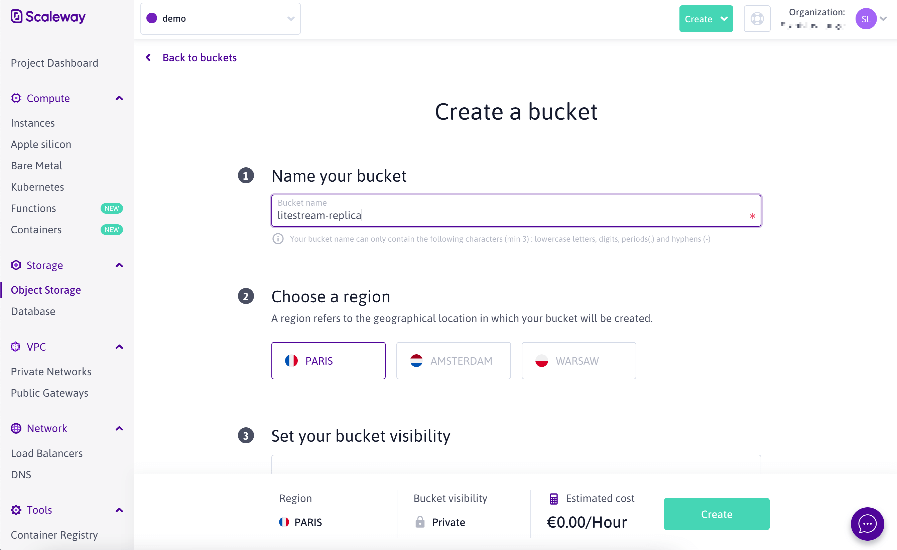
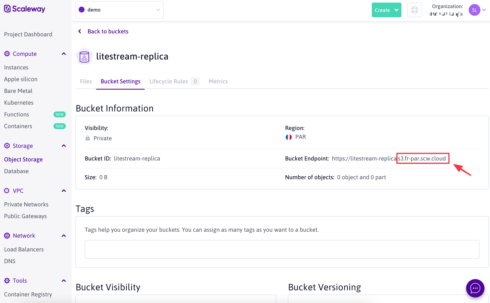
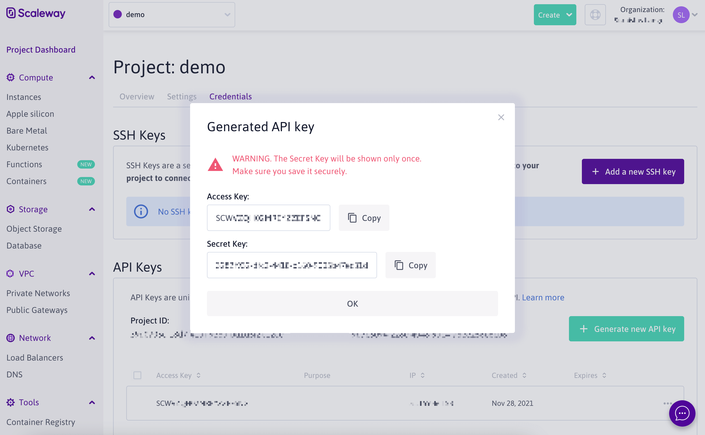

This guide will show you how to use [Scaleway Object Storage][os] as a database
replica path for Litestream. You will need a [Scaleway][scw] account to
complete this guide.

## Setup

### Create a bucket

In the [Scaleway Console][console], click on the green _"Create"_ button
in the top navigation and choose _"Object Storage Bucket"_.

On the _"Create a bucket"_ screen, you'll need to choose a region and name your
space a globally unique name. Then click the _"Create a bucket"_ button at the
bottom of the screen.

<figure>
	
</figure>

After your bucket is created, you'll see the hostname of your bucket in the format `<bucket-name>.s3.<region>.scw.cloud`. You will need the bucket name, the region and the regional endpoint (`s3.<region>.scw.cloud`) for use later when configuring Litestream.

<figure>
    
</figure>

### Create a key

You'll need to create a key to authenticate Litestream to your account so it can
access the bucket. In the console, click _"Project Dashboard in the sidebar"_. Then click on the _"Credentials"_ tab.

Scroll down to the _API keys_ section and click the _"Generate new
API Key"_ button. You'll need to provide a name for key and then hit Enter. You'll
be presented with the access key id and secret access key. **You will need to
copy those for use later.**

<figure>
    
</figure>

## Usage

### Configuration file usage

Here is an example `litestream.yml` configuration file. Make sure to specifi the `region` and `endpoint` values.

```yaml
dbs:
  - path: /path/to/local/db
    replica:
      type: s3
      bucket: <bucket-name>
      path: db
      endpoint: s3.<region>.scw.cloud # e.g. s3.fr-par.scw.cloud
      region: <region> # e.g. fr-par
      access-key-id: SCWXXXXXXXXXXXXXXXXX
      secret-access-key: xxxxxxxx-xxxx-xxxx-xxxx-xxxxxxxxxxxx
```

[os]: https://www.scaleway.com/en/object-storage/
[scw]: https://www.scaleway.com/
[console]: https://console.scaleway.com/
