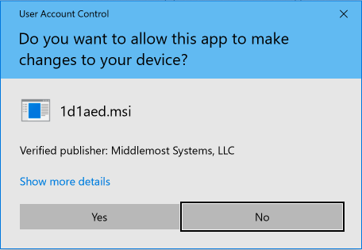
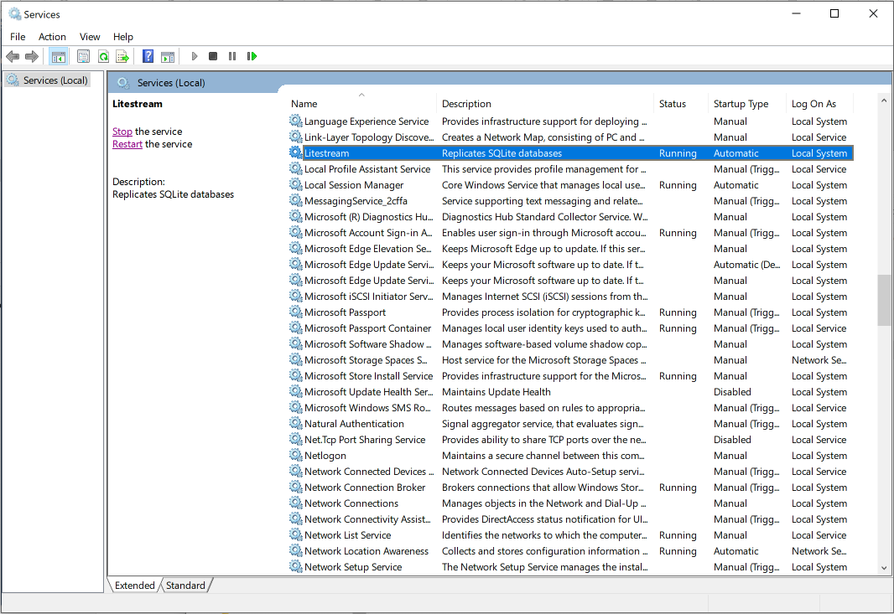

This guide will get you running Litestream on the Windows operating system as
either a command line tool or as a background Windows Service. 


## Prerequisites

This guide assumes you have read the [_Getting Started_](/getting-started)
tutorial already. Please read that to understand the basic operation of Litestream.


## Running as a Windows Service

Running Litestream as a Windows Service means that it will run in the background
and continuously monitor and replicate your databases. This is the recommended
way to run Litestream.

To install, download and run the `.msi` installer from the [Litestream releases
page][releases]. You'll be presented with a window asking if the app can make
changes to your device. Click _"Yes"_.

<center>
	
</center>
<br/>

Once the installer is done, your Litesteam service will be running. The
[configuration file](/reference/config) for Litestream is installed at:

```
C:\Litestream\litestream.yml
```


### Managing the service

When you first install Litestream, it will run using an empty [configuration
file](/reference/config). Whenever you update this file, you'll need to restart
the service.

Go to the _Services_ application and select the Litestream service. You should
see links in the sidebar to _Stop_ and _Restart_ the service.

<figure>
	
</figure>


### Viewing the event log

The Litestream service logs informational and error messages to the Windows
Event Log during operation. You can view these events in either the _Event
Viewer_ application or you can view them from PowerShell.

In PowerShell, you can execute the following:

```
Get-EventLog -LogName Application -Source Litestream
```

This will show events in reverse chronological order:

```
PS C:\> Get-EventLog -LogName Application -Source Litestream

   Index Time          EntryType   Source                 InstanceID Message
   ----- ----          ---------   ------                 ---------- -------
    8894 Jan 01 00:00  Information Litestream                      1 replicating to: name="s3" type="s3" bucket="dev...
    8892 Jan 01 00:00  Information Litestream                      1 initialized db: C:\my.db...
    8891 Jan 01 00:00  Information Litestream                      1 litestream v0.3.10...
    8890 Jan 01 00:00  Information Litestream                      1 Litestream service starting...
```


## Running from the command line 

If you do not wish to run as a background service or you only need to perform
a database restore then you can download the Litestream executable and run
from the command line.

You'll need to download the `litestream.exe` file from the [Litestream releases
page][releases] and install it within your Windows `%PATH%`. The executable will
use `C:\Litestream\litestream.yml` as the default configuration path but you
can override that with the `-config` flag.

All logging messages will go to the terminal window when running from the
command line and the Event Log is not used.


[releases]: https://github.com/benbjohnson/litestream/releases

